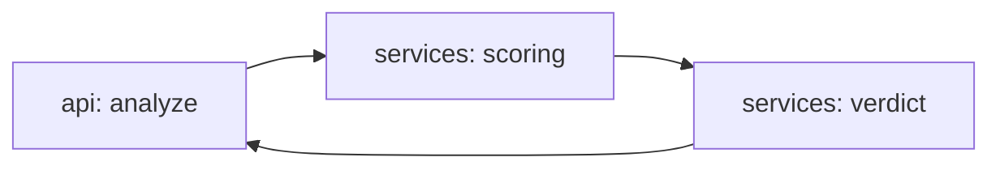

# agent-startup-analyst

[](https://github.com/Shamanchi/agent-startup-analyst/actions/workflows/ci.yml)
[](https://www.python.org/)
[](./Dockerfile)
[](./LICENSE)

> **English TL;DR:** FastAPI startup analyst: scores an idea on market/team/traction/competition with transparent points, lists strengths and risks, gives a verdict. Fully offline, no tokens needed.

Агент анализа стартапов: оценивает идею по рынку/команде/трекшену/конкуренции с прозрачными баллами, показывает сильные стороны и риски, выносит вердикт. Работает офлайн.

Источник темы: `Hands-On-AI-Engineering / P-142 (startup_analyst)` — идею и постановку взяли из каталога, код и тексты написаны с нуля.

## Какую задачу решает

Нужно быстро прикинуть жизнеспособность идеи: агент считает баллы по четырём критериям, объясняет сильные и слабые стороны и даёт вердикт fundable/promising/risky.

## Архитектура



Слои: `api/` → `services/` → `core/`, настройки через `pydantic-settings`.

## Быстрый старт

```bash
cp .env.example .env
pip install -r requirements.txt
uvicorn app.main:app --reload
curl -X POST http://127.0.0.1:8000/api/v1/analyze -H "Content-Type: application/json" -d "{\"idea\": \"CRM for dentists\", \"market_size\": \"large\", \"team_size\": 4, \"paying_users\": 12, \"competitors\": 3}"
```

Docker:

```bash
docker compose up --build
```

## API

- `GET /api/v1/health` — проверка сервиса.
- `GET /api/v1/criteria` — критерии и веса.
- `POST /api/v1/analyze` — анализ идеи. Тело: `{"idea": "...", "market_size": "large", "team_size": 4, "paying_users": 12, "competitors": 3}`. Ответ: `scores`, `total`, `verdict`, `strengths`, `risks`.

Пример ответа `analyze` (сокращённо):

```json
{
  "total": 95,
  "verdict": "fundable",
  "scores": {"market": 25, "team": 25, "traction": 25, "competition": 20},
  "strengths": ["Paying users validate demand"],
  "risks": []
}
```

## Переменные окружения (.env)

| Переменная | Назначение | По умолчанию |
|---|---|---|
| `FUNDABLE_SCORE` | Баллы для вердикта fundable | `85` |
| `PROMISING_SCORE` | Баллы для вердикта promising | `60` |
| `APP_HOST` / `APP_PORT` | Хост/порт API | `0.0.0.0` / `8000` |

Полный список — в [.env.example](./.env.example).

## Тесты

```bash
pip install -r requirements.txt
pytest -q
pytest -q -m integration
```

Unit-тесты без сети. Интеграционные (`-m integration`) — через TestClient, тоже без сети.

## Контакты

- Telegram: @PavelYrevichh
- Email: Lietman46@mail.ru
- GitHub: Shamanchi
- FL.ru: https://www.fl.ru/users/Shamanchi
